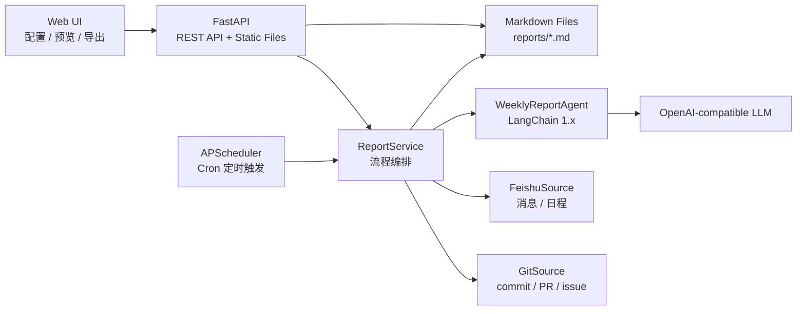

# 自动生成工作周报助手设计文档

## 1. 背景与目标

研发同学的工作轨迹分散在 Git 提交、PR / Issue、飞书群消息和日程中。人工整理周报容易遗漏上下文，也难以保持统一表达。本项目设计一个企业级周报 Agent：按配置定时采集 Git 与飞书数据，交由 LangChain 1.x + LLM 归纳生成 Markdown 周报，并通过 Web UI 展示、配置与导出。

核心目标：

- 面向企业内部部署，配置、凭证、模型和输出路径均可调整。
- 接入 Git commit / PR / issue。
- 接入飞书消息与日程。
- 提供定时触发、手动触发、结果展示页和 Markdown 导出。
- 周报必须按当前自然周生成：周一 00:00 到下周一 00:00，不使用滚动 7 天。
- 包含 FastAPI 与 LangChain 1.x。

## 2. 总体架构

运行链路：

1. Web 页面读取 `/api/config`，展示可编辑配置项。
2. APScheduler 根据 `schedule.cron` 定时调用 `ReportService.generate()`。
3. `ReportService` 按服务本地日期计算当前自然周窗口。
4. `GitSource` 与 `FeishuSource` 分别采集自然周窗口内的数据。
5. 数据被归一化为 `WorkItem`，避免 Agent 依赖外部 API 的原始结构。
6. `WeeklyReportAgent` 通过 LangChain Prompt、自定义模板和自然周边界调用模型生成 Markdown。
7. Markdown 文件写入 `report.output_dir`，页面渲染最新结果并支持导出。

## 3. 模块设计

### 3.1 配置层

文件：`src/config.py`

配置覆盖：

- `schedule`：Cron 表达式。时区不进入配置，统一由服务运行环境决定。
- `sources.git`：Git provider、Token、仓库、采集类型、代理策略和演示数据开关。
- `sources.feishu`：飞书 OpenAPI 地址、应用凭证、消息采集配置、日程采集配置。
- `llm`：模型、API Key、base URL、temperature、timeout。
- `report`：自定义 Markdown 模板、章节、输出路径、文件名前缀。
- `web`：服务地址、端口、导出开关。

### 3.2 数据源层

文件：

- `src/sources/git_source.py`
- `src/sources/feishu_source.py`

统一输出模型：

| 字段 | 说明 |
| --- | --- |
| `source` | 数据来源，`git` / `feishu` |
| `type` | 数据类型，`commit` / `pull_request` / `issue` / `message` / `calendar_event` |
| `title` | 标题或摘要 |
| `author` | 作者、发送人或组织者 |
| `status` | 状态，例如 `merged`、`open`、`sent`、`scheduled` |
| `url` | 原始链接 |
| `updated_at` | 更新时间或发生时间 |
| `repo` | Git 仓库，可为空 |
| `metadata` | 扩展字段，例如 issue labels、PR number、chat_id、event_id |

关键取舍：

- Agent 只消费标准 `WorkItem`，便于后续扩展 Jira、飞书任务、会议纪要等数据源。
- 飞书凭证支持 `app_id/app_secret` 自动换取租户 token，也支持直接传 token。
- 凭证缺失时可按配置返回演示数据，保证项目可直接启动和验收。

### 3.3 飞书接入设计

飞书消息：

- 配置 `sources.feishu.messages.chat_ids` 指定群聊。
- 使用当前自然周起止时间过滤消息。
- 将消息转换为 `WorkItem(type="message")`。

飞书日程：

- 配置 `sources.feishu.calendar.calendar_ids` 指定日历，默认 `primary`。
- 使用当前自然周起止时间过滤日程。
- 将日程转换为 `WorkItem(type="calendar_event")`。

权限取舍：

- 群消息通常要求应用具备 IM 只读权限，且机器人或用户身份能访问目标群聊。
- 用户主日历通常需要用户访问令牌；企业共享日历可按应用权限配置。
- 真实部署建议使用企业密钥系统管理 `app_secret` 与 access token。

### 3.4 Agent 层

文件：`src/agent/weekly_report_agent.py`

职责：

- 将标准化工作项转换为 LLM 可理解的 JSON 输入。
- 将当前自然周起止时间传入 Prompt，避免模型按最近 7 天理解“本周”。
- 将 `report.template` 作为强约束输出格式，支持企业自定义周报结构。
- 使用 LangChain 1.x 的 `ChatPromptTemplate`、`ChatOpenAI`、`StrOutputParser` 组成生成链。
- 对输出进行章节校验，确保包含必需章节。
- 当模型 Key 缺失或调用失败时，使用本地兜底生成器。

### 3.5 服务层

文件：`src/services/report_service.py`

职责：

- 编排 Git 采集、飞书采集、归一化、生成、保存。
- 计算当前自然周窗口：周一 00:00 到下周一 00:00。
- 提供最新报告查询。
- 计算报告元数据：生成时间、输出路径、工作项数量、来源统计、是否使用 LLM。

### 3.6 调度层

文件：`src/scheduler.py`

职责：

- 使用 APScheduler 注册 Cron 任务。
- 示例默认 `* * * * *`，每分钟触发。
- 使用 `coalesce=True` 与 `max_instances=1` 避免任务堆积和并发写同一类报告。

### 3.7 Web 层

文件：

- `web/index.html`
- `web/styles.css`
- `web/app.js`

能力：

- 编辑 Git Token 与仓库 ID。
- 编辑飞书 App ID、App Secret、Token、群聊 ID、日历 ID。
- 展示自然周规则。
- 编辑自定义周报模板。
- 编辑输出路径。
- 手动生成、渲染 Markdown、导出 Markdown。

## 4. API 设计

| API | 方法 | 请求 | 响应 |
| --- | --- | --- | --- |
| `/api/health` | GET | 无 | `{"status":"ok"}` |
| `/api/config` | GET | 无 | 当前配置 JSON |
| `/api/config` | POST | 配置 JSON | 保存状态 |
| `/api/reports/generate` | POST | `template` 可选 | Markdown 与元数据 |
| `/api/reports/latest` | GET | 无 | 最新 Markdown |
| `/api/reports/export` | GET | 无 | Markdown 文件下载 |

## 5. 企业级关键取舍

- FastAPI 适合作为内部 Agent 应用 API 层，具备类型校验与 OpenAPI 文档。
- LangChain 1.x 统一 Prompt、模型调用和输出解析，后续可扩展为多工具 Agent。
- Markdown 文件便于审计和导出，生产环境可扩展到 PostgreSQL + 对象存储。
- 演示数据兜底保证评审环境无凭证时仍能运行，真实环境填入凭证后切换到真实数据。

## 6. 开发步骤

1. 骨架搭建：完成 `src`、`web`、`docs`、`config`、`requirements.txt`。
2. 配置系统：实现 YAML 加载、环境变量展开、页面保存和定时任务重载。
3. Git 接入：实现 GitHub commit / PR / issue 采集。
4. 飞书接入：实现消息 / 日程采集和凭证换取。
5. Agent 生成：实现 LangChain Prompt、模型调用、章节兜底校验和本地兜底生成。
6. 结果展示：实现配置表单、手动生成、Markdown 渲染和导出。
7. 企业增强：增加 SSO、审计日志、PostgreSQL、任务队列、告警与多租户隔离。

## 7. 安全与合规

- 不在仓库中提交真实 Token、API Key、App Secret。
- Web 页面展示配置时生产环境应对密钥字段脱敏。
- LLM 输入可能包含内部研发信息，需按企业策略选择私有模型或允许的数据出境方案。
- 日志禁止打印完整密钥和大段原始业务数据。
- 导出接口应受权限控制，避免内部周报被非授权访问。
