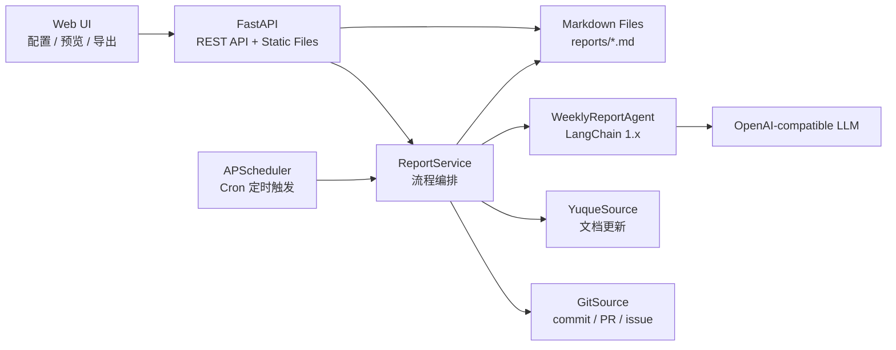

# 自动生成工作周报助手设计文档

## 1. 背景与目标

研发同学的工作轨迹分散在 Git 提交、PR 讨论、Issue 状态和语雀文档更新中。人工整理周报容易遗漏上下文，也难以保持统一表达。本项目设计一个企业级周报 Agent：按配置定时采集多源数据，交由 LangChain 1.x + LLM 归纳生成 Markdown 周报，并通过 Web UI 展示、配置与导出。

核心目标：

- 面向企业内部部署，配置、凭证、模型和输出路径均可调整。
- 必须接入 Git commit / PR / issue 与语雀文档更新。
- 必须提供定时触发、手动触发、结果展示页和 Markdown 导出。
- 周报必须按当前自然周生成：周一 00:00 到下周一 00:00，不使用滚动 7 天。
- 必须包含 FastAPI 与 LangChain 1.x。
- 示例配置可直接运行，便于评审和二次开发。

## 2. 总体架构

运行链路：

1. Web 页面读取 `/api/config`，展示可编辑配置项。
2. APScheduler 根据 `schedule.cron` 定时调用 `ReportService.generate()`。
3. `ReportService` 按服务本地日期计算当前自然周窗口。
4. `ReportService` 调用 Git 与语雀适配器采集自然周窗口内的数据。
5. 数据被归一化为 `WorkItem`，避免 Agent 依赖外部 API 的原始结构。
6. `WeeklyReportAgent` 通过 LangChain Prompt、自定义模板和自然周边界调用模型生成 Markdown。
7. Markdown 文件写入 `report.output_dir`，页面渲染最新结果并支持导出。

## 3. 模块设计

### 3.1 配置层

文件：`src/config.py`

职责：

- 加载 `config/example.yaml`。
- 展开 `${ENV_NAME}` 环境变量。
- 使用 Pydantic 校验配置字段。
- 支持页面保存配置并重载定时任务。

配置覆盖：

- `schedule`：Cron 表达式。时区不进入配置，统一由服务运行环境决定。
- `sources.git`：Git provider、Token、仓库、采集类型。
- `sources.yuque`：语雀 Token、namespace、文档采集开关。
- `llm`：模型、API Key、base URL、temperature、timeout。
- `report`：自定义 Markdown 模板、章节、输出路径、文件名前缀。
- `web`：服务地址、端口、导出开关。

### 3.2 数据源层

文件：

- `src/sources/git_source.py`
- `src/sources/yuque_source.py`

统一输出模型：

| 字段 | 说明 |
| --- | --- |
| `source` | 数据来源，`git` / `yuque` |
| `type` | 数据类型，`commit` / `pull_request` / `issue` / `doc` |
| `title` | 标题或提交摘要 |
| `author` | 作者 |
| `status` | 状态，例如 `merged`、`open`、`updated` |
| `url` | 原始链接 |
| `updated_at` | 更新时间 |
| `repo` | Git 仓库，可为空 |
| `metadata` | 扩展字段，例如 issue labels、PR number |

关键取舍：

- Agent 只消费标准 `WorkItem`，便于后续增加 GitLab、Jira、飞书文档等数据源。
- 凭证缺失时返回演示数据，保证项目可直接启动和验收。
- 当前实现 GitHub API，GitLab 通过同一适配器接口扩展。

### 3.3 Agent 层

文件：`src/agent/weekly_report_agent.py`

职责：

- 将标准化工作项转换为 LLM 可理解的 JSON 输入。
- 将当前自然周起止时间传入 Prompt，避免模型按最近 7 天理解“本周”。
- 将 `report.template` 作为强约束输出格式，支持企业自定义周报结构。
- 使用 LangChain 1.x 的 `ChatPromptTemplate`、`ChatOpenAI`、`StrOutputParser` 组成生成链。
- 对输出进行章节校验，确保包含必需章节。
- 当模型 Key 缺失或调用失败时，使用本地兜底生成器。

Prompt 约束：

- 你是资深研发效能专家。
- 输出中文 Markdown。
- 本周范围必须严格等于输入的自然周周期，禁止使用最近 7 天。
- 必须包含 `本周完成`、`进行中`、`风险/阻塞`、`下周计划`。
- 不得编造未在数据源中出现的事实。
- 不确定内容使用“待确认 / 可能”。
- 尽量保留来源链接，方便审计。

### 3.4 服务层

文件：`src/services/report_service.py`

职责：

- 编排采集、归一化、生成、保存。
- 计算当前自然周窗口：周一 00:00 到下周一 00:00。
- 提供最新报告查询。
- 计算报告元数据：生成时间、输出路径、工作项数量、来源统计、是否使用 LLM。

### 3.5 调度层

文件：`src/scheduler.py`

职责：

- 使用 APScheduler 注册 Cron 任务。
- 示例默认 `* * * * *`，每分钟触发。
- 不在配置中维护时区，Cron 触发时间使用服务运行环境的本地时间。
- 使用 `coalesce=True` 与 `max_instances=1` 避免任务堆积和并发写同一类报告。

### 3.6 Web 层

文件：

- `web/index.html`
- `web/styles.css`
- `web/app.js`

能力：

- 编辑数据源凭证。
- 编辑仓库 / 项目 ID。
- 展示自然周规则。
- 编辑自定义周报模板。
- 编辑输出路径。
- 手动生成。
- 渲染 Markdown。
- 导出最新 Markdown。

## 4. API 设计

| API | 方法 | 请求 | 响应 |
| --- | --- | --- | --- |
| `/api/health` | GET | 无 | `{"status":"ok"}` |
| `/api/config` | GET | 无 | 当前配置 JSON |
| `/api/config` | POST | 配置 JSON | 保存状态 |
| `/api/reports/generate` | POST | `template` 可选 | Markdown 与元数据，含自然周起止时间 |
| `/api/reports/latest` | GET | 无 | 最新 Markdown |
| `/api/reports/export` | GET | 无 | Markdown 文件下载 |

## 5. 企业级关键取舍

### 5.1 FastAPI

FastAPI 具备类型校验、OpenAPI 文档、异步 I/O 和部署简洁性，适合作为内部 Agent 应用的 API 层。静态页面也可由同一服务托管，降低交付复杂度。

### 5.2 LangChain 1.x

LangChain 提供 Prompt、模型调用、输出解析和后续工具化 Agent 的统一抽象。当前先采用稳定的生成链，后续可以升级为多工具 Agent，例如按需查询 PR 评论、Issue 明细或文档正文。

### 5.3 文件存储

Markdown 是周报的天然载体，便于审计、版本管理和导出。生产环境可把报告元数据写入 PostgreSQL，把 Markdown 同步到对象存储或知识库。

### 5.4 本地兜底

企业评审环境经常没有外部 Token 或模型 Key。系统采用演示数据和本地兜底生成，确保“可启动、可展示、可验证”。正式环境填入凭证后自动切换到真实数据和真实 LLM。

## 6. 开发步骤

### 阶段一：基础骨架

1. 创建 `src`、`web`、`docs`、`config`、`reports` 目录。
2. 编写 `requirements.txt`，固定 FastAPI、APScheduler、LangChain 1.x、httpx、PyYAML、Pydantic。
3. 实现 `src/main.py`，提供健康检查、静态页面托管和基础 API。

### 阶段二：配置系统

1. 定义 Pydantic 配置模型。
2. 支持 YAML 加载与环境变量展开。
3. 提供 `/api/config` GET / POST。
4. 保存配置后重载 APScheduler。

### 阶段三：数据源接入

1. 实现 GitHub commits API。
2. 实现 GitHub pulls API，转换为 PR 工作项。
3. 实现 GitHub issues API，并过滤 PR 类型 issue。
4. 实现语雀 docs API，采集文档更新时间。
5. 缺失凭证时返回演示数据。

### 阶段四：Agent 生成

1. 设计周报 Prompt。
2. 使用 LangChain 1.x 连接 OpenAI-compatible 模型。
3. 生成 Markdown 并校验必需章节。
4. 实现本地兜底生成器。
5. 保存 `reports/weekly-report-YYYYMMDD-HHMMSS.md`。

### 阶段五：Web UI

1. 实现配置表单。
2. 实现手动生成按钮。
3. 使用 marked.js 渲染 Markdown。
4. 实现导出按钮。
5. 显示生成时间、工作项数量、是否使用 LLM。

### 阶段六：生产增强

1. 增加 SSO / RBAC，保护配置页与导出接口。
2. 引入 PostgreSQL 存储报告元数据、执行日志、用户配置。
3. 引入 Redis + Celery，将采集和生成任务异步化。
4. 增加失败重试、告警通知和任务运行历史。
5. 增加敏感信息脱敏、Token 加密存储和审计日志。
6. 增加多租户配置隔离和团队级模板管理。

## 7. 安全与合规

- 不在仓库中提交真实 Token、API Key。
- Web 页面展示配置时生产环境应对密钥字段脱敏。
- LLM 输入可能包含内部研发信息，需按企业策略选择私有模型或允许的数据出境方案。
- 日志禁止打印完整密钥和大段原始业务数据。
- 导出接口应受权限控制，避免内部周报被非授权访问。

## 8. 可观测性

建议生产环境增加以下指标和日志：

- 任务执行：开始时间、结束时间、耗时、成功/失败状态。
- 数据源：各来源采集数量、API 状态码、失败原因。
- Agent：模型名称、输入条数、输出长度、兜底触发次数。
- 文件输出：报告路径、文件大小、导出次数。
- 告警：连续失败、Token 失效、LLM 超时、数据源不可用。
